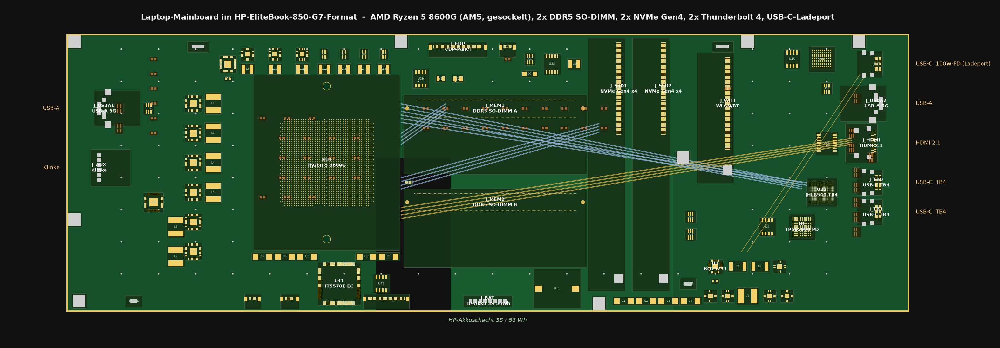
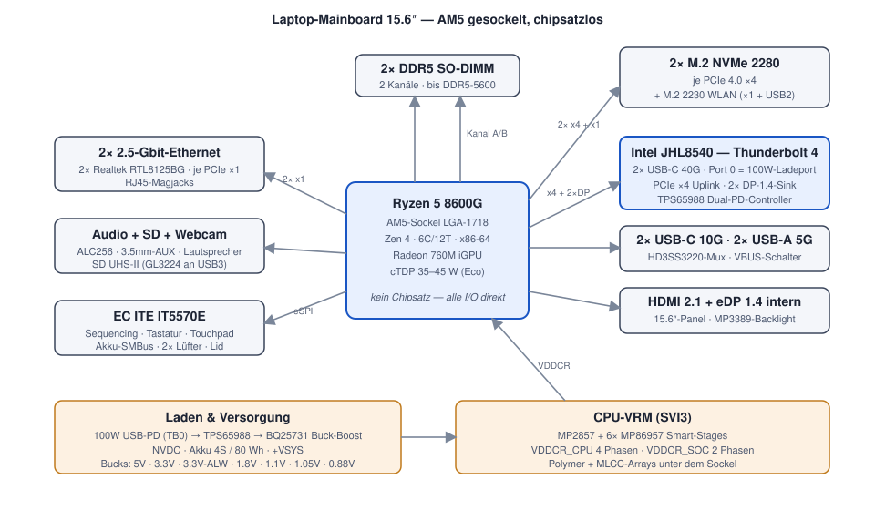

# Laptop-Mainboard — AMD AM5 im HP-EliteBook-850-G7-Chassis (Rev B)

Komplettes KiCad-8-Projekt für ein Laptop-Mainboard mit **gesockelter**
Desktop-CPU (AM5) statt verlöteter Mobile-CPU.





## Eckdaten

| Bereich | Umsetzung |
|---|---|
| CPU | **AMD Ryzen 5 8600G** (x86-64, Zen 4, 6C/12T, Radeon 760M) im **AM5-Sockel LGA-1718** — wechselbar wie beim Desktop-PC, per cTDP auf 35–45 W gedrosselt |
| Chipsatz | **keiner** (chipsatzlos wie DeskMini X600) — alle I/O direkt vom SoC |
| Pinbelegung | **alle 1718 AM5-Pins benannt** (docs/am5_pinmap.csv, WikiChip/Wikimedia Public Domain); 1708 Sockelpads im Board mit echtem Signal-Netz |
| RAM | 2× DDR5 **SO-DIMM** (1 DIMM pro Kanal, bis DDR5-5600, max. 96 GB) |
| Storage | 2× **M.2 2280 NVMe**, je PCIe 4.0 ×4, getrennt schaltbare 3.3-V-Schienen |
| WLAN | 1× M.2 2230 E-Key (PCIe ×1 + USB 2.0), z. B. Wi-Fi 7 Modul |
| Thunderbolt | 2× **Thunderbolt 4** über **Intel JHL8540** (Maple Ridge), PCIe ×4 Uplink + 2× DP-1.4-Sink |
| Laden | **Eigener USB-C-Ladeport** (100 W USB-PD, TPS65987D) an der Barrel-Jack-Position → **BQ25731** → HP-Akku 3S/56 Wh (NVDC) |
| USB | 2× USB-A 5 Gbit (je einer links/rechts, wie 850 G7) |
| Netzwerk | WLAN/BT über M.2-Modul (das Original hat kein RJ45) |
| Video | HDMI 2.1 (nativ vom SoC, TPD12S016-Companion), intern eDP 1.4 (2 Lanes) |
| Audio | Realtek ALC256, 3.5-mm-Kombiklinke (AUX), 2× 2-W-Lautsprecher |
| Kleinteile | Blatt 10: MLCC-Bänke, 11 ESD-Arrays, USB2-Chokes, Straps (beidseitige Bestückung) |
| EC | ITE IT5570E: Power-Sequencing, Tastatur 8×18, Akku-SMBus, 2× Lüfter |
| Board | 340 × 112 mm, 8 Lagen, Portlayout/Umriss für HP EliteBook 850 G7 (docs/elitebook.md) |

## Projektstruktur

```
laptop-mainboard/
├── kicad/                     KiCad-8-Projekt (öffnen: laptop-mainboard.kicad_pro)
│   ├── laptop-mainboard.kicad_sch   Übersichtsblatt (Hierarchie)
│   ├── 01_power_pd.kicad_sch        USB-PD, Laderegler, Systemschienen
│   ├── 02_vrm_cpu.kicad_sch         CPU-VRM (SVI3, 4+2 Phasen)
│   ├── 03_cpu_am5.kicad_sch         AM5-Sockel, BIOS-Flash, RTC
│   ├── 04_memory.kicad_sch          2× DDR5 SO-DIMM
│   ├── 05_storage.kicad_sch         2× M.2 NVMe + WLAN
│   ├── 06_usb_tb4.kicad_sch         Thunderbolt 4 + USB
│   ├── 07_ladeport.kicad_sch        USB-C-Ladeport 100W (TPS65987D)
│   ├── 08_display.kicad_sch         eDP, HDMI, Backlight, Webcam
│   ├── 09_audio_sd_ec.kicad_sch     Audio, Embedded Controller
│   ├── 10_kleinteile.kicad_sch      Entkopplung, ESD, Filter, Straps
│   ├── laptop-mainboard.kicad_pcb   Board: Umriss, Platzierung, Lagen, Zonen
│   ├── lm.kicad_sym                 Symbolbibliothek
│   └── laptop_mainboard.pretty/     Footprints (inkl. LGA-1718, SO-DIMM 262)
├── docs/
│   ├── architektur.md         Blockdiagramm, PCIe-/USB-/Display-Budget
│   ├── power.md               Schienen, Power-Budget, Sequencing
│   ├── layout.md              Lagenaufbau, Floorplan, Routing-Regeln
│   ├── elitebook.md           EliteBook-850-G7-Einbau: passt/zu messen
│   ├── am5_pinmap.csv         Alle 1718 AM5-Pins mit Signalnamen
│   ├── grenzen.md             Was dieses Projekt (bewusst) nicht abdeckt
│   ├── board_render.png       Bestückungsansicht (generiert)
│   └── bom.csv                Stückliste (150 Positionen)
└── tools/
    └── gen_all.py             Generator — erzeugt alle KiCad-Dateien
```

**Wichtig:** Die KiCad-Dateien werden generiert. Änderungen in
`tools/kicadgen/boarddata*.py` (Schaltung) bzw. `tools/gen_all.py`
(Floorplan) vornehmen und `python3 tools/gen_all.py` ausführen.

## Warum diese Architektur?

- **Gesockelte CPU:** AMD verkauft Mobile-CPUs nur als BGA (verlötet). Der
  Wunsch „normaler PC-Sockel statt löten" führt zwingend zum Desktop-Sockel
  AM5. Der Ryzen 5 8600G ist die effizienteste AM5-Wahl: monolithischer
  Phoenix-Die (kein Chiplet-Idle-Verbrauch), starke iGPU, offizieller
  cTDP-Bereich 35–65 W.
- **Chipsatzlos:** Ein B650-Chipsatz würde ~7 W dauerhaft verbrauchen. Der
  8600G hat genug eigene Lanes/USB-Ports für alle geforderten Anschlüsse.
- **Echtes Thunderbolt 4:** AMD kann nur USB4. Für zertifizierbares TB4 sitzt
  ein Intel JHL8540 auf dem Board (PCIe ×4 + 2× DisplayPort vom SoC).
- **NVDC-Laden:** Der BQ25731 lässt das System direkt aus dem 100-W-Netzteil
  laufen und lädt den Akku mit dem Rest — Standard-Topologie moderner Laptops.

## Ehrlichkeit / Reifegrad

Rev B ist ein **weit ausgearbeiteter Prototyp-Stand**: vollständige
Systemarchitektur, echte AM5-Pinbelegung (Public-Domain-Quelle) an allen
Sockelpads, Kleinteile (Entkopplung/ESD/Filter) auf eigenem Blatt,
kollisionsfreier beidseitiger Floorplan im EliteBook-Format mit Zonen,
Stitching-Vias und Routing-Korridoren. **Noch nicht bestellbar:** das
DRC-saubere Feinrouting aller ~640 Netze, die Verifikation der
Community-Pinmap und die HP-Mechanik-/FPC-Vermessung stehen aus —
Details in [docs/grenzen.md](docs/grenzen.md) und
[docs/elitebook.md](docs/elitebook.md).
