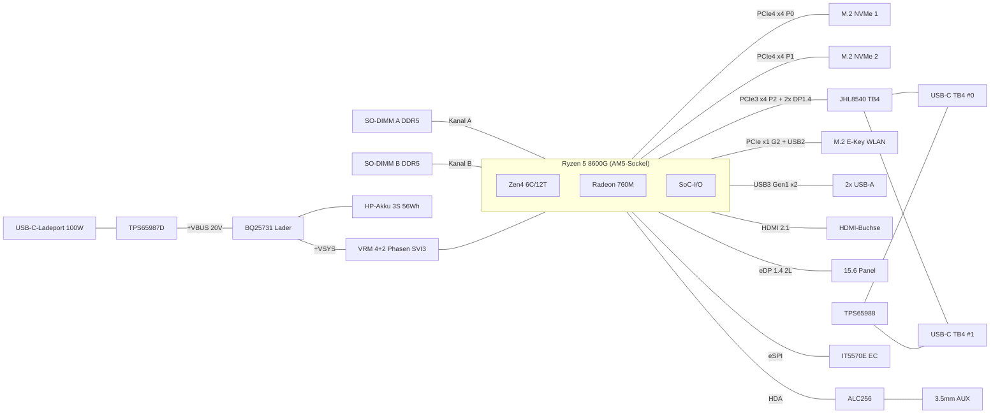

# Systemarchitektur

## Blockdiagramm

## PCIe-Lane-Budget (Phoenix, 20× Gen4)

| SoC-Port | Breite | Gen | Verwendung |
|---|---|---|---|
| P0 | ×4 | 4 | M.2 NVMe #1 |
| P1 | ×4 | 4 | M.2 NVMe #2 |
| P2 | ×4 | 3 | Thunderbolt-Controller JHL8540 |
| G0 | ×1 | — | frei (Reserve) |
| G1 | ×1 | — | frei (Reserve) |
| G2 | ×1 | 3 | WLAN M.2 E-Key |
| Referenztakte | — | — | 6× 100 MHz vom SoC-GPP-Clocktree (PE_CLK0…5) |

## USB-Portzuordnung

| SoC-Port | Geschwindigkeit | Ziel |
|---|---|---|
| U3G2_1 / USB2_1 | 10G / 480M | USB-A #1 (links) |
| U3G2_2 / USB2_2 | 10G / 480M | USB-A #2 (links) |
| USB2_3 | 480M | USB-C-Ladeport (Datenpfad) |
| USB2_5 / USB2_6 | 480M | TB4-Ports (USB-2.0-Pfad) |
| USB2_7 | 480M | WLAN/Bluetooth |
| USB2_8 | 480M | Webcam |

## Display-Budget (4 Pipes des SoC)

1. **eDP 1.4, 2 Lanes** → internes 15.6"-Panel (bis 2560×1440@60)
2. **HDMI 2.1** → externe Buchse (TMDS direkt, DDC/CEC über TPD12S016)
3. **DP0** → JHL8540 DP-IN 0 (Thunderbolt-Ausgabe Port 0)
4. **DP1** → JHL8540 DP-IN 1 (Thunderbolt-Ausgabe Port 1)

## Management-Busse

- **eSPI**: SoC ↔ EC (IT5570E)
- **SVI3**: SoC ↔ VRM-Controller MP2857 (SVC/SVD/SVT)
- **I3C/SMBus (SPD_HSCL/HSDA)**: SoC ↔ DIMM-SPD-Hubs
- **I2C (EC)**: Akku (Smart Battery), Laderegler BQ25731, PD-Controller TPS65988
- **I2C (PD↔TB)**: TPS65988 ↔ JHL8540 (Alternate-Mode-Aushandlung)
